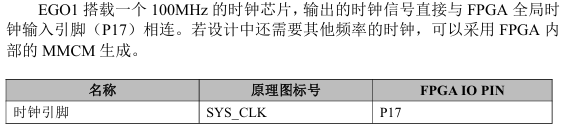
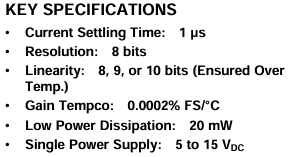
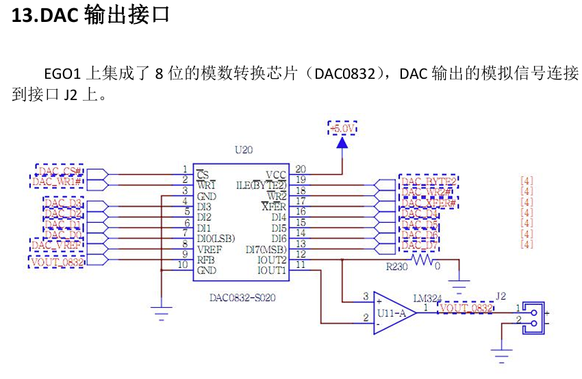
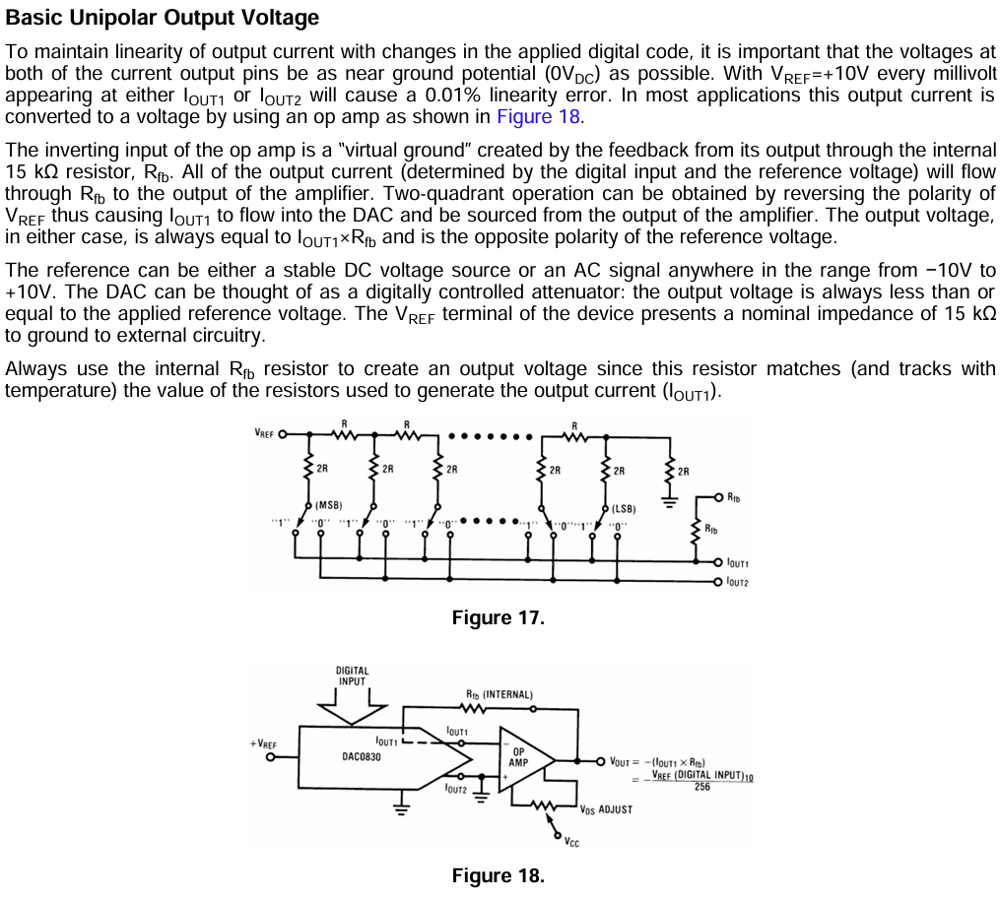
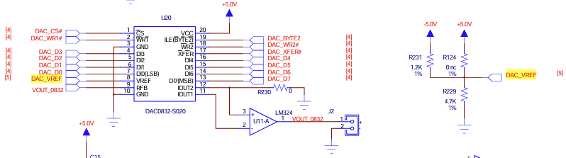
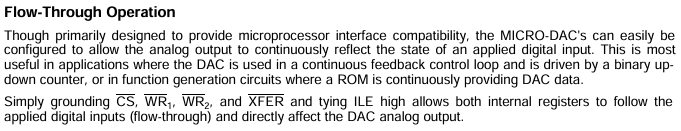

# DDS

直接数字频率合成（DDS）本质是用数字方法精确控制相位，再通过查表输出波形

## 采样

以正弦信号为例，我们要生成一个频率为 $f_{\text{out}}$ 的理想正弦信号
$$
s(t) = A \sin\big(2\pi f_{\text{out}} t + \phi_0\big)
\tag{1}
$$
定义瞬时相位（单位：弧度）
$$
\Phi(t) = 2\pi f_{\text{out}} t + \phi_0
\tag{2}
$$
则
$$
\frac{d\Phi(t)}{dt} = 2\pi f_{\text{out}} = \omega_{\text{out}}
\tag{3}
$$
相位随时间线性增长，斜率为角频率 $\omega_{\text{out}} = 2\pi f_{\text{out}}$

DDS 是数字系统，使用固定时钟频率 $f_{\text{clk}}$ 对相位进行采样，时钟周期
$$
T_{\text{clk}} = \frac{1}{f_{\text{clk}}}
\tag{4}
$$
我们在每个时钟上升沿更新一次相位，设第 $n$ 个时钟周期的离散时刻为
$$
t_n = n \cdot T_{\text{clk}}, \quad n = 0,1,2,\dots
$$
则离散相位序列为
$$
\Phi[n] = \Phi(n T_{\text{clk}}) = 2\pi f_{\text{out}} \, n T_{\text{clk}} + \phi_0
\tag{5}
$$
相邻两个时刻的相位增量（步长）是常数
$$
\Delta\Phi = \Phi[n+1] - \Phi[n] = 2\pi f_{\text{out}} T_{\text{clk}} = 2\pi \frac{f_{\text{out}}}{f_{\text{clk}}}
\tag{6}
$$
为了让数字电路处理，需要把相位量化为有限位宽的整数，引入**相位累加器**

我们把完整相位周期 $2\pi$ 映射到整数范围 $0$ 到 $2^N - 1$，$N$ 为相位累加器位宽

对于一个N位的二进制累加器，每个时钟周期将内部保存的相位值 $\Phi$ 加上一个常数，记作 $M$（即**频率控制字**，Frequency Tuning Word，FTW），然后取模 $2^N$（自然溢出即可实现模运算），即
$$
\Phi(n) = \big( \Phi(n-1) + M \big) \bmod 2^N
\tag{7}
$$
定义满量程 $\Phi_{\max} = 2^N$ 对应于一个完整的正弦周期 $2\pi$ 弧度，则任意时刻的瞬时相位角为
$$
\theta(n) = 2\pi \cdot \frac{\Phi(n)}{2^N}
\tag{8}
$$
相位累加器每时钟帧增加 $M$，相当于每 $T_{clk}$ 秒增加的相位角角度为
$$
\Delta\theta = 2\pi \cdot \frac{M}{2^N}
\tag{9}
$$
由（3）式，令离散增量与连续增量相等，得
$$
\omega_{out} = \frac{\Delta\theta}{T_{clk}} = 2\pi \cdot \frac{F_{tw}}{2^N} \cdot f_{clk}
\tag{10}
$$
两边除以 $2\pi$ 得到输出频率
$$
\boxed{ f_{out} = \frac{F_{tw} \cdot f_{clk}}{2^N} }
\tag{11}
$$
根据奈奎斯特采样定理，对于一个最高频率为 $f_H$ 的连续时间信号，采样频率 $f_s$ 必须满足
$$
f_s > 2 f_H
$$
才能无失真地重建原信号，DDS中系统时钟 $f_{clk}$ 就是 DAC 的更新率，也就是采样频率 $f_s = f_{clk}$ ，所以理论上，DDS 能输出的最大正弦波频率就是 $f_{clk}/2$

## 波形查找表

累加器在 $n$ 时刻的值为
$$
\Phi[n] = \big( n \cdot M + \Phi_0 \big) \bmod 2^N
\tag{12}
$$
其中 $\Phi_0$ 是初始相位对应的整数（即**相位控制字**）

通常我们只取 $\Phi[n]$ 的高几位作为**波形查找表**（LUT）的地址，因为完整 $N$ 位做地址会要求太大的 ROM

设取高位位数为 $A$ 位（地址宽度），则地址索引
$$
\text{idx}[n] = \left\lfloor \frac{\Phi[n]}{2^{N-A}} \right\rfloor
\tag{13}
$$
我们预计算一个周期的正弦波采样值，存储在 ROM 中，希望得到原始信号为标准双极性正弦，即
$$
s(k) = \sin\!\left( \frac{2\pi k}{2^A} \right)
\tag{14}
$$
其中 $k = 0, 1, \dots, 2^A-1$ 是相位累加器截断后的索引，输出值域为 $[-1, +1]$，但是，DAC接受单极性数字码（比如 0 到 $2^D-1$，对应电压 0 到 $V_{\text{ref}}$，$D$ 即DAC分辨率），不能直接把负电压给DAC，于是添加直流偏置并乘缩放因子
$$
s_{\text{uni}}(k) = \frac{1}{2} + \frac{1}{2} \sin\!\left( \frac{2\pi k}{2^A} \right)
\tag{15}
$$
即单极性正弦公式，再把 $[0, 1]$ 的幅度线性映射到这个DAC的整数区间，得波形查找表
$$
\begin{aligned}
\text{LUT}[k] &= \text{round}\!\left( \left[ \frac{1}{2} + \frac{1}{2} \sin\!\left( \frac{2\pi k}{2^A} \right) \right] \times (2^D - 1) \right) \\
&= \text{round}\!\left( \frac{2^D - 1}{2} + \frac{2^D - 1}{2} \sin\!\left( \frac{2\pi k}{2^A} \right) \right)
\end{aligned}
\tag{16}
$$
其中$\text{round}(\cdot)$为量化取整，把连续值四舍五入变成D位整数存储到LUT

综上，DDS数字输出序列为
$$
x[n] = \text{LUT}\big[ idx(n) \big]
\tag{17}
$$
这里 $n$ 是时钟周期索引

## 滤波

DAC 在每个采样周期将 $x[n]$ 保持为常值，直到下一个时钟沿，则输出可建模为
$$
x_{DAC}(t) = \sum_{n=-\infty}^{\infty} x[n] \cdot \text{rect}\!\left( \frac{t - nT_{clk} - T_{clk}/2}{T_{clk}} \right)
\tag{18}
$$
其中矩形函数
$$
\text{rect}(t) = \begin{cases} 1, & |t| \le 1/2 \\ 0, & \text{otherwise} \end{cases}
$$
实际上我们把这种DAC的每个采样周期保持输出一恒定值的过程称作零阶保持模型（Zero-Order Hold, ZOH）

对于理想的冲激采样信号
$$
x_s(t) = \sum_{n=-\infty}^{\infty} x[n] \, \delta(t - nT)
$$
它的每个冲激的强度就是采样值，如果把 $x_s(t)$ 输入一个冲激响应为 $h(t)$​ 的系统，输出就是
$$
y(t) = x_s(t) * h(t) = \sum_{n} x[n] \int_{-\infty}^{\infty} \delta(\tau - nT) \, h(t - \tau) d\tau = \sum_{n} x[n] \, h(t - nT)
$$
比较此式与前面直接用矩形叠加的式子，若取
$$
h(t) = \text{rect}\!\left( \frac{t - T/2}{T} \right)
$$
则 $h(t - nT) = \text{rect}\!\left( \frac{t - nT - T/2}{T} \right)$，这正是我们需要的那个矩形脉冲

所以，零阶保持过程完全等价于一个冲激响应为宽度 $T$、延迟 $T/2$ 的矩形脉冲的 LTI 系统，即
$$
h_{\text{ZOH}}(t) = \text{rect}\!\left( \frac{t - T/2}{T} \right)
$$
则DAC的采样保持可由理想采样与矩形脉冲的卷积描述

理想采样信号为
$$
x_s(t) = \sum_{n} x[n] \,\delta(t - nT_{clk})
$$
其傅里叶变换为
$$
\begin{aligned}
X_s(f) &= \int_{-\infty}^{\infty} x_s(t) \, e^{-j2\pi f t} \, dt \\
&= \int_{-\infty}^{\infty} \left( \sum_{n} x[n] \, \delta(t - nT) \right) e^{-j2\pi f t} \, dt \\
&= \sum_{n} x[n] \int_{-\infty}^{\infty} \delta(t - nT) \, e^{-j2\pi f t} \, dt \\ 
&= \sum_{n=-\infty}^{\infty} x[n] \, e^{-j2\pi f n T}
\end{aligned}
$$
对于原始连续正弦时间信号 $x(t)$，其傅里叶变换记为 $X_{\text{ideal}}(f)$，根据傅里叶逆变换
$$
x[n] = x(nT) = \int_{-\infty}^{\infty} X_{\text{ideal}}(\nu) \, e^{j2\pi \nu n T} \, d\nu
$$
带入上式，得
$$
\begin{aligned}
X_s(f) &= \sum_{n} \left( \int_{-\infty}^{\infty} X_{\text{ideal}}(\nu) \, e^{j2\pi \nu n T} d\nu \right) e^{-j2\pi f n T} \\
&= \int_{-\infty}^{\infty} X_{\text{ideal}}(\nu) \left( \sum_{n} e^{-j2\pi (f - \nu) n T} \right) d\nu
\end{aligned}
$$
由于 $$p(t) = \sum_{n=-\infty}^{\infty} \delta(t - nT)$$ ， $$P(f) = \frac{1}{T} \sum_{k=-\infty}^{\infty} \delta\!\left( f - \frac{k}{T} \right)$$ ，由定义 $p(t) = \int_{-\infty}^{\infty} P(f) \, e^{j2\pi f t} \, df$ ，则
$$
\sum_n \delta(t - nT) = \int \frac{1}{T} \sum_k \delta\!\left(f - \frac{k}{T}\right) e^{j2\pi f t} df = \frac{1}{T} \sum_k e^{j2\pi (k/T) t}
$$
即
$$
\sum_{n=-\infty}^{\infty} \delta(t - nT) = \frac{1}{T} \sum_{k=-\infty}^{\infty} e^{j2\pi \frac{k}{T} t}
$$
对上式两边傅里叶变换，以 $\alpha$ 为频率变量，则
$$
\sum_{n=-\infty}^{\infty} e^{-j2\pi \alpha n T} = \frac{1}{T} \sum_{k=-\infty}^{\infty} \delta\!\left( \alpha - \frac{k}{T} \right)
$$
令 $\alpha = f - \nu$，则
$$
\sum_{n} e^{-j2\pi (f - \nu) n T} = \frac{1}{T} \sum_{k=-\infty}^{\infty} \delta\!\left( f - \nu - \frac{k}{T} \right)
$$
带回原式
$$
\begin{aligned}
X_s(f) &= \int_{-\infty}^{\infty} X_{\text{ideal}}(\nu) \left[ \frac{1}{T} \sum_{k} \delta\!\left( f - \nu - \frac{k}{T} \right) \right] d\nu \\[4pt]
&= \frac{1}{T} \sum_{k=-\infty}^{\infty} \int_{-\infty}^{\infty} X_{\text{ideal}}(\nu) \, \delta\!\left( \nu - \left( f - \frac{k}{T} \right) \right) d\nu \\
&= \frac{1}{T} \sum_{k=-\infty}^{\infty} X_{\text{ideal}}\!\left( f - \frac{k}{T} \right) \\
&=  f_{\text{clk}} \sum_{k=-\infty}^{\infty} X_{\text{ideal}}(f - k f_{\text{clk}})
\end{aligned}
$$
零阶保持相当于与一个宽度为 $T_{clk}$ 的矩形脉冲卷积
$$
h_{ZOH}(t) = \text{rect}\!\left( \frac{t - T_{clk}/2}{T_{clk}} \right)
$$
其傅里叶变换为
$$
H_{ZOH}(f) = T_{clk} \, \text{sinc}(f T_{clk}) \, e^{-j\pi f T_{clk}}
$$
因此 DAC 输出频谱为
$$
\begin{aligned}
X_{DAC}(f) &= X_s(f) \cdot H_{ZOH}(f) \\
&= T_{clk} \, \text{sinc}(f T_{clk}) \, e^{-j\pi f T_{clk}} \cdot f_{clk} \sum_{k=-\infty}^{\infty} X_{\text{ideal}}(f - k f_{clk}) \\
&=  \text{sinc}\!\left(\frac{f}{f_{clk}}\right) e^{-j\pi f / f_{clk}} \sum_{k=-\infty}^{\infty} X_{\text{ideal}}(f - k f_{clk})
\end{aligned}
\tag{19}
$$
由此可见，主信号位于 $k=0$ 项，$X_{\text{ideal}}(f)$ 乘以 $\text{sinc}(f/f_{clk})$ 包络，在 $f = f_{out}$ 处，sinc 的值约为 $\text{sinc}(f_{out}/f_{clk}) \approx 1$（当 $f_{out} \ll f_{clk}$ 时），近乎无损

镜像频率出现在 $k = \pm 1, \pm 2, \dots$ 处，即频率 $k f_{clk} \pm f_{out}$。它们被 sinc 包络衰减，但幅度依然可观，特别是在 $f_{clk} - f_{out}$ 附近

所以，需要一个截止频率 $f_c$ 满足
$$
f_{\text{out,max}} \le f_c \ll f_{\text{clk}} - f_{\text{out,max}}
$$
的LPF，保留 $f_{\text{out}}$，同时把最低频率的镜像 $f_{\text{clk}} - f_{\text{out}}$ 抑制到足够小的程度

为了在滤波器的复杂度、相位线性和成本之间平衡，工程上通常把最大输出频率限制在 $f_{\text{clk}}/4$ 甚至更低，比如取
$$
f_c \approx 1.5 \times f_{\text{out,max}}
$$
或取
$$
\quad f_c \approx 0.4\, f_{\text{clk}}
$$

## 实现

使用DDS计算波形信号，通过EGO1的DAC0832外设实现信号发生器功能，代码编辑使用python的amaranth库，见SignalGenerator.py

由EGO1用户手册，板载时钟源为100MHz



DAC0832芯片手册，建立时间（当改变输入的数字编码（比如从全 0 跳到全 1）后，模拟输出（电流或电压）进入并保持在最终值附近某个误差带内（通常是 ±½ LSB）所需的时间）为1us



则为了使DAC有稳定输出，将时钟信号128分频，得到新时钟周期约为1.28us，防止输出失真

上图 `Resolution: 8 bits ` 说明DAC0832分辨率为 8 位

我们选择 24 位相位累加器，取高 8 位，比如对正弦波而言，2^8 = 256 点量化的理论信噪比约 48 dB，对于通用信号发生器已经很好，每个采样点间隔 360°/256 = 1.4°，波形肉眼看起来连续平滑

FTW由式（11）计算得，即 `ftw_value = int(self.FREQ_HZ * (1 << self.N) / self.F_DAC)`

由手册，DAC0832为电流输出型DAC，但是EGO1已外接运放转电压，可以看出EGO1的运放接法与手册中的Figure18相同，则
$$
V_{OUT} = - \frac{D}{256} \times V_{REF}
$$






确定 $V_{ref}$ 即可确定输出电压大小，由原理图 $V_{ref} = 5V$ (存疑)



使用式（15）（16）预计算LUT，直流偏置 2.5V，又要求幅度 2V，即峰峰值 2Vpp，波形需要从 2.5V 向上摆 1V 到 3.5V ，向下摆 1V 到 1.5V ，则对应代码中偏置 128，偏移量 3.5 / 5 * 256 - 128 = 51，再通过信号函数计算LUT即可

配置CS=WR1=WR2=XFER=0，ILE=1，即下图中的”流量直通“配置，这种配置下，两个内部锁存器都变成透明的，数据线上的任何变化都会立刻反应到模拟输出端，便于调试且没有软件延迟



代码架构

| 方法/函数               | 类型            | 作用                                                         |
| ----------------------- | --------------- | ------------------------------------------------------------ |
| `_clamp(code)`          | `@staticmethod` | 将 LUT 代码值限制在 `[0, 255]` 范围内，防止量化取整越界      |
| `_build_sine_lut()`     | 实例方法        | 根据 DDS 公式 (16) 预计算 256 点单极性正弦波 LUT：$128 + 51 \times \sin(2\pi k / 256)$ |
| `_build_square_lut()`   | 实例方法        | 预计算 256 点方波 LUT：前半周期为高电平 (179)，后半周期为低电平 (77)，占空比 50% |
| `_build_triangle_lut()` | 实例方法        | 预计算 256 点三角波 LUT：从最低点线性上升到最高点再线性下降，对称三角波 |
| `__init__()`            | 构造函数        | 定义所有 I/O 端口信号：`dac_data`(8)、5 个 DAC 控制信号、`clk`、`rst` |
| `elaborate(platform)`   | 硬件描述入口    | 构建完整的数字电路：DAC 控制逻辑、时钟分频器、DDS 相位累加器、LUT 查找表、DAC 输出寄存器 |
| `__main__`              | 脚本入口        | 调用 `verilog.convert` 生成 [SignalGenerator.v](vscode-webview://0qqm7eqam3a0ouhlanc3vda01imgqt6b0a7hf215nvlr8e4p7209/SignalGenerator.v)，生成 [SignalGenerator.xdc](vscode-webview://0qqm7eqam3a0ouhlanc3vda01imgqt6b0a7hf215nvlr8e4p7209/SignalGenerator.xdc) 引脚约束，打印参数报告并验证频率范围和分辨率 |

运行结果

```powershell
(FPGA-env) PS D:\UserFiles\MyProjects\FPGAProject\FPGA> python SignalGenerator.py
========================================================
  DDS Signal Generator — EGO1 + DAC0832
========================================================
  Waveform          : sine
  Target frequency  : 1000 Hz
  Actual frequency  : 999.96 Hz
  FTW               : 21474 (0x0053E2)
  Frequency res.    : 0.05 Hz
  DAC update rate   : 781250 Hz
  Amplitude         : 2 Vpp (center 2.5 V)
  DAC mode          : single buffer
--------------------------------------------------------
  Verilog           : SignalGenerator.v
  Constraints       : SignalGenerator.xdc
========================================================
```

在Vivado中创建工程，导入生成的 `.v` 和 `.xdc` 文件，生成比特流烧进EGO1，在板载 `J2` 排针处通过示波器检验生成的模拟波形

# 调制

信号的调制，简单来说，就是把原始信息信号（**基带信号**）加载到一个**高频载波**上的过程

## 幅度调制（AM）

调制信号（基带信号）通常是我们要传递的信息，比如人的语音、音乐等。这里为了方便推导，假设它是一个单一频率的余弦波
$$
m(t) = A_m \cos(2\pi f_m t)
\tag{20}
$$
其中：

$m(t)$：调制信号的瞬时值（单位与波形有关，通常是电压）
$A_m$：调制信号的振幅（峰值幅度），且 $A_m \geq 0$
$f_m$：调制信号的频率（Hz），通常 $f_m \ll f_c$（载波频率）

载波信号为高频正弦波，负责承载信息的传播
$$
c(t) = A_c \cos(2\pi f_c t)
\tag{21}
$$
其中：

$c(t)$：载波的瞬时值
$A_c$：载波的振幅（峰值幅度），未调制时是恒定值
$f_c$：载波频率（Hz），$f_c \gg f_m$

在AM中，我们要让载波的振幅不再是常数 $A_c$，而是跟随调制信号 $m(t)$ 变化。具体来说，振幅部分应变成
$$
A_{\text{env}}(t) = A_c + m(t)
\tag{22}
$$
为了确保这个**包络**始终非负（普通AM常用包络检波恢复信号），必须满足 $A_c + m(t) \geq 0 \quad \forall t$ ，若 $m(t)$ 对称，则要求 $A_c \geq A_m$，因此，已调制信号可以写成载波乘以这个时变振幅 
$$
s_{\text{AM}}(t) = [A_c + m(t)] \cdot \cos(2\pi f_c t)
\tag{23}
$$
带入式（20），有
$$
s_{\text{AM}}(t) = A_c \cos(2\pi f_c t) + A_m \cos(2\pi f_m t) \cdot \cos(2\pi f_c t)
$$
积化和差
$$
A_m \cos(2\pi f_m t) \cos(2\pi f_c t) = \frac{A_m}{2} \cos(2\pi (f_c - f_m) t) + \frac{A_m}{2} \cos(2\pi (f_c + f_m) t)
$$
则
$$
\begin{aligned}
s_{\text{AM}}(t) &= A_c \cos(2\pi f_c t) \;+\; \frac{A_m}{2} \cos\big(2\pi (f_c - f_m)t\big) \;+\; \frac{A_m}{2} \cos\big(2\pi (f_c + f_m)t\big)
\end{aligned}
\tag{24}
$$
这样我们就得到：一个单频调制AM信号由三个频率分量组成

载波分量：$A_c \cos(2\pi f_c t)$ —— 频率 $f_c$，幅度 $A_c$
下边频（LSB）：$\dfrac{A_m}{2} \cos\big(2\pi (f_c - f_m)t\big)$ —— 频率 $f_c - f_m$，幅度 $\dfrac{A_m}{2}$
上边频（USB）：$\dfrac{A_m}{2} \cos\big(2\pi (f_c + f_m)t\big)$ —— 频率 $f_c + f_m$，幅度 $\dfrac{A_m}{2}$

为了衡量调制深度，引入调制指数（调制深度） $m$
$$
m = \frac{A_m}{A_c}
\tag{25}
$$
根据之前非负条件，要求 $0 \le m \le 1$

那么 $A_m = m A_c$，代入已调信号表达
$$
\begin{aligned}
s_{\text{AM}}(t) &= A_c \cos(2\pi f_c t) + \frac{m A_c}{2} \cos\big(2\pi (f_c - f_m)t\big) + \frac{m A_c}{2} \cos\big(2\pi (f_c + f_m)t\big) \\[4pt]
&= A_c \left[ \cos(2\pi f_c t) + \frac{m}{2} \cos\big(2\pi (f_c - f_m)t\big) + \frac{m}{2} \cos\big(2\pi (f_c + f_m)t\big) \right]
\end{aligned}
\tag{26}
$$
有时也写成原时域包络形式
$$
s_{\text{AM}}(t) = A_c [1 + m \cos(2\pi f_m t)] \cos(2\pi f_c t)
\tag{27}
$$
当 $m=0$：信号只有载波，没有调制，相当于发送一个纯载波
当 $0<m\le 1$：包络幅度在 $A_c(1-m)$ 到 $A_c(1+m)$ 之间变化，不会出现过零点，可以完美用包络检波恢复原信号
当 $m>1$：过调制，包络变形，用包络检波会失真，所以一般AM都要求 $m\le 1$

## 频率调制（FM）

我们想把一个低频信息信号“写”到高频载波的频率里

记调制信号
$$
m(t) = A_m \cos(2\pi f_m t)
$$
未调制载波
$$
c(t) = A_c \cos(\theta_c(t))
$$
其中：

$A_c$：载波幅度（常数）
$\theta_c(t)$：载波的总瞬时相位（单位为弧度）

在没有调制时，载波频率恒定 $f_c$，相位为 $\theta_c(t) = 2\pi f_c t + \phi_0$，通常取初相 $\phi_0 = 0$，则 
$$
c(t) = A_c \cos(2\pi f_c t)
$$
FM意味着瞬时频率按调制信号的瞬时值成线性比例偏移中心频率 $f_c，即
$$
f_i(t) = f_c + k_f \, m(t)
\tag{28}
$$
其中：

$f_i(t)$：在时刻 $t$ 的瞬时频率（单位：Hz）
$k_f$：频率灵敏度（也称调制常数），单位是 $\text{Hz}$ 每单位调制信号幅度（例如 $\text{Hz/V}$）。
$m(t)$：调制信号瞬时值

如果 $m(t)$ 是正值，则频率向上偏移；负值则向下偏移。最大偏移量称为频偏 $\Delta f$，对单频调制 $\Delta f = k_f A_m$

频率是相位对时间的导数，即
$$
\frac{d\theta_i(t)}{dt} = 2\pi f_i(t)
\tag{29}
$$
这里 $\theta_i(t)$ 是已调信号的总瞬时相位

两边对时间积分，从 $0$ 到 $t$
$$
\theta_i(t) = 2\pi \int_0^t f_i(\tau) \, d\tau + \theta_i(0)
$$
假定初始相位 $\theta_i(0) = 0$ ，将 FM 定义式 $f_i(t) = f_c + k_f m(t)$ 代入积分，得
$$
\begin{aligned}
\theta_i(t) &= 2\pi \int_0^t \big[ f_c + k_f m(\tau) \big] d\tau \\[4pt]
&= 2\pi f_c t + 2\pi k_f \int_0^t m(\tau) \, d\tau
\end{aligned}
\tag{30}
$$
其中：

$2\pi f_c t$：载波线性积累的相位
$2\pi k_f \int_0^t m(\tau) d\tau$：由调制信号导致的相位偏移

所以已调信号仍是一个幅度恒定的高频余弦波，只是相位被调变了，即
$$
s_{\text{FM}}(t) = A_c \cos\Big( \theta_i(t) \Big) = A_c \cos\left( 2\pi f_c t + 2\pi k_f \int_0^t m(\tau) \, d\tau \right)
\tag{31}
$$
式（31）即为任意调制信号 $m(t)$ 的 FM 时域一般表达式

代入单频调制信号（20），积分项
$$
\int_0^t m(\tau) d\tau = \int_0^t A_m \cos(2\pi f_m \tau) \, d\tau = A_m \cdot \frac{1}{2\pi f_m} \big[ \sin(2\pi f_m \tau) \big]_0^t = \frac{A_m}{2\pi f_m} \sin(2\pi f_m t)
$$
于是相位偏移项变为
$$
2\pi k_f \cdot \frac{A_m}{2\pi f_m} \sin(2\pi f_m t) = \frac{k_f A_m}{f_m} \sin(2\pi f_m t)
\tag{32}
$$
定义调制指数
$$
\beta = \frac{k_f A_m}{f_m} = \frac{\Delta f}{f_m}
\tag{33}
$$
其中：

$\Delta f = k_f A_m$：峰值频偏（最大频率偏移，单位 Hz）
$f_m$：调制信号频率
$\beta$：调制指数，无量纲，单位是弧度（表示最大相位偏移）

FM中这个比值非常重要，它决定了频谱展宽程度

因此，单频 FM 信号可写成一个简洁形式
$$
s_{\text{FM}}(t) = A_c \cos\Big( 2\pi f_c t + \beta \sin(2\pi f_m t) \Big)
\tag{34}
$$

## 正弦脉宽调制（SPWM）

记调制波
$$
v_m(t) = V_m \cos(\omega_m t)
\tag{35}
$$
其中：

$V_m$：调制波幅值（峰值），单位：伏特（V）
$\omega_m = 2\pi f_m$：调制波角频率，$f_m$为目标输出频率

载波为高频双极性三角波，如果令 $t=0$ 时为正峰值 $V_t$，那么区间 $[0, T_c)$ 上的完整周期的表达式为
$$
v_{\text{tri}}(t) =
\begin{cases}
V_t - \dfrac{4V_t}{T_c} t, & 0 \le t < \dfrac{T_c}{2} \\[8pt]
-3V_t + \dfrac{4V_t}{T_c} t, & \dfrac{T_c}{2} \le t < T_c
\end{cases}
\tag{36}
$$
或写成
$$
v_{\text{tri}}(t) = \frac{2V_t}{\pi} \arcsin\!\big(\sin(\omega_c t + \frac{\pi}{2})\big)
\tag{37}
$$
定义幅值调制比
$$
m_a = \frac{V_m}{V_t} \quad (0 \leq m_a \leq 1 \quad \text{线性调制区})
\tag{38}
$$
定义频率调制比（载波比）
$$
m_f = \frac{f_c}{f_m} \quad (\text{一般 } m_f \gg 1, \text{ 整数})
\tag{39}
$$
我们希望实现比较功能，即当 $v_m(t) > v_{\text{tri}}(t)$ 时，上桥臂导通，输出相电压（相对于直流中点）为 $+V_{dc}/2$；反之，输出 $-V_{dc}/2$。于是
$$
v_{\text{an}}(t) = \frac{V_{dc}}{2} \cdot \operatorname{sgn}\!\big( v_m(t) - v_{\text{tri}}(t) \big)
$$
下面求出 $v_{\text{an}}(t)$ 的傅里叶级数，展示其基波与谐波成分

对于由两个独立周期（调制波周期和载波周期）决定的函数 $f(t)$，可构造二维函数 $F(x,y)$，其中 $x = \omega_m t$，$y = \omega_c t$，使得 $f(t) = F(\omega_m t, \omega_c t)$。$F(x,y)$ 同时对 $x$ 和 $y$ 具有周期性：

$F(x + 2\pi, y) = F(x,y)$ （调制波周期 $2\pi$）
$F(x, y + 2\pi) = F(x,y)$ （载波周期 $2\pi$）

则 $f(t)$ 的双重傅里叶级数为：
$$
f(t) = \sum_{m=0}^{\infty} \sum_{n=-\infty}^{\infty} K_{mn} \, e^{j(m x + n y)}
\tag{40}
$$
其中复系数
$$
K_{mn} = \frac{1}{4\pi^2} \int_{x=0}^{2\pi} \int_{y=0}^{2\pi} F(x,y) \, e^{-j(m x + n y)} \, dy \, dx
$$
对于双极性自然采样，三角波可定义为 $y$ 的函数：在一个载波周期 $y \in [0, 2\pi)$ 内，采用如下分段线性函数，使得三角波在 $y=0$ 处达到正峰值，下降再上升
$$
v_{\text{tri}}(y) =
\begin{cases}
V_t \left(1 - \dfrac{2}{\pi} y \right), & 0 \leq y < \pi \\[6pt]
V_t \left( \dfrac{2}{\pi} y - 3 \right), & \pi \leq y < 2\pi
\end{cases}
\tag{41}
$$
当 $y=0$ 时 $v_{\text{tri}} = V_t$；$y=\pi$ 时 $v_{\text{tri}} = -V_t$；$y=2\pi$ 时又回到 $V_t$

调制波定义为 $x$ 的函数
$$
v_m(x) = V_m \cos x
\tag{42}
$$
调制指数 $m_a = V_m/V_t$

比较器输出
$$
S(x,y) = \begin{cases}
+1, & \text{if } v_m(x) > v_{\text{tri}}(y) \\
-1, & \text{if } v_m(x) < v_{\text{tri}}(y)
\end{cases}
\tag{43}
$$
则瞬时输出电压
$$
v_{\text{an}}(t) = \frac{V_{dc}}{2} S(\omega_m t, \omega_c t)
\tag{44}
$$
只需分析 $S(x,y)$ 的双重傅里叶级数，然后乘上因子 $V_{dc}/2$

在一个载波周期 $y$ 内，$S=+1$ 的区间为
$$
y \in \left[ \frac{\pi}{2}(1 - m_a \cos x), \; \frac{\pi}{2}(3 + m_a \cos x) \right] \quad \text{(mod } 2\pi \text{)}
\tag{45}
$$
$S(x,y)$ 取值 $\pm 1$，是一个分段常数函数，可以直接积分求 $K_{mn}$
$$
K_{mn} = \frac{1}{4\pi^2} \int_{0}^{2\pi} \int_{0}^{2\pi} S(x,y) \, e^{-j(m x + n y)} \, dy \, dx
$$
对于固定的 $x$，$S(x,y)$ 在 $y$ 轴上是宽度为 $y_{\text{off}} - y_{\text{on}}$ 的正脉冲（高电平 +1），其余地方为 -1。所以内层积分
$$
\begin{aligned}
I_y(x) &= \int_{0}^{2\pi} S(x,y) \, e^{-j n y} dy \\
&= \int_{y_{\text{on}}}^{y_{\text{off}}} (+1) e^{-j n y} dy + \int_{\text{其余}} (-1) e^{-j n y} dy
\end{aligned}
$$
“其余”是两个区间：$[0, y_{\text{on}})$ 和 $(y_{\text{off}}, 2\pi]$。可以写成整个 $[0,2\pi]$ 减去正区间
$$
I_y(x) = \int_{y_{\text{on}}}^{y_{\text{off}}} e^{-j n y} dy \;-\; \left( \int_{0}^{y_{\text{on}}} e^{-j n y} dy + \int_{y_{\text{off}}}^{2\pi} e^{-j n y} dy \right) = 2\int_{y_{\text{on}}}^{y_{\text{off}}} e^{-j n y} dy \;-\; \int_0^{2\pi} e^{-j n y} dy
$$
而第二个积分只有当 $n=0$ 时非零，则
$$
I_y(x) = \begin{cases}
2 (y_{\text{off}} - y_{\text{on}}) - 2\pi, & n = 0 \\[6pt]
2 \cdot \dfrac{e^{-j n y_{\text{on}}} - e^{-j n y_{\text{off}}}}{j n}, & n \neq 0
\end{cases}
$$
代入
$$
y_{\text{on}} = \frac{\pi}{2}(1 - m_a \cos x), \qquad
y_{\text{off}} = \frac{\pi}{2}(3 + m_a \cos x)
$$
脉冲宽度
$$
y_{\text{off}} - y_{\text{on}} = \frac{\pi}{2}(3 + m_a \cos x - 1 + m_a \cos x) = \frac{\pi}{2}(2 + 2 m_a \cos x) = \pi(1 + m_a \cos x)
$$
当 $n=0$ 时
$$
I_y(x) = 2\pi(1 + m_a \cos x) - 2\pi = 2\pi m_a \cos x
$$
当 $n \neq 0$ 时
$$
\begin{aligned}
e^{-j n y_{\text{on}}} &= \exp\!\left[-j n \frac{\pi}{2}(1 - m_a \cos x)\right] = e^{-j n \pi/2} \cdot e^{\,j n \frac{\pi}{2} m_a \cos x} \\
e^{-j n y_{\text{off}}} &= \exp\!\left[-j n \frac{\pi}{2}(3 + m_a \cos x)\right] = e^{-j 3n\pi/2} \cdot e^{-j n \frac{\pi}{2} m_a \cos x}
\end{aligned}
$$
则
$$
e^{-j n y_{\text{on}}} - e^{-j n y_{\text{off}}} = e^{-j n \pi/2} e^{\,j \xi_n \cos x} - e^{-j 3n\pi/2} e^{-j \xi_n \cos x}
$$
其中定义了
$$
\xi_n = \frac{n \pi}{2} m_a
$$
利用 $e^{-j 3n\pi/2} = e^{-j n\pi} \cdot e^{-j n\pi/2} = (-1)^n e^{-j n\pi/2}$，上式变为
$$
I_y(x) = \frac{2}{j n} e^{-j n\pi/2} \left[ e^{\,j \xi_n \cos x} - (-1)^n e^{-j \xi_n \cos x} \right]
$$
于是对于 $n \neq 0$
$$
I_y(x) = \frac{2}{j n} e^{-j n\pi/2} \left[ e^{\,j \xi_n \cos x} - (-1)^n e^{-j \xi_n \cos x} \right]
$$
对外层 $x$ 积分
$$
K_{mn} = \frac{1}{4\pi^2} \int_{0}^{2\pi} I_y(x) \, e^{-j m x} dx
$$
当 $n = 0$
$$
I_y(x) = 2\pi m_a \cos x = \pi m_a (e^{j x} + e^{-j x})
$$
则
$$
K_{m0} = \frac{1}{4\pi^2} \int_0^{2\pi} \pi m_a (e^{j x} + e^{-j x}) e^{-j m x} dx = \frac{m_a}{4\pi} \int_0^{2\pi} (e^{j(1-m)x} + e^{-j(1+m)x}) dx
$$
积分非零仅当 $m=1$ 或 $m=-1$（但 $m\ge 0$，保留 $m=1$）。对于 $m=1$
$$
K_{10} = \frac{m_a}{4\pi} \int_0^{2\pi} 1 \cdot dx = \frac{m_a}{2}
$$
类似地，对于 $m$ 为其他非负整数，$K_{m0}=0$

注意 $S$ 是实函数，可求得三角函数系数：$A_{m0} = 2\,\operatorname{Re}(K_{m0})$，$B_{m0} = -2\,\operatorname{Im}(K_{m0})$。这里 $K_{10} = m_a/2$ 是实数，因此 $A_{10} = m_a$，$B_{10}=0$。所以基波项出现在 $m=1,n=0$，即频率 $\omega_m$，幅度为 $m_a$（对应 $S$ 的基波分量）

略去其他繁琐推导过程，自然采样双极性 SPWM 相电压精确频谱为
$$
\boxed{
\begin{aligned}
v_{\text{an}}(t) &= \frac{V_{dc}}{2} m_a \cos(\omega_m t) \\
&\quad + \frac{2V_{dc}}{\pi} \sum_{n=1}^{\infty} \frac{1}{n} J_0\!\left( n \frac{\pi}{2} m_a \right) \sin\!\left( n \frac{\pi}{2} \right) \cos( n \omega_c t ) \\
&\quad + \frac{2V_{dc}}{\pi} \sum_{n=1}^{\infty} \sum_{\substack{k=-\infty \\ k \neq 0}}^{\infty} \frac{1}{n} J_k\!\left( n \frac{\pi}{2} m_a \right) \sin\!\left( (n+k) \frac{\pi}{2} \right) \cos( k \omega_m t + n \omega_c t )
\end{aligned}
}
\tag{46}
$$
第一项：基波分量，频率 $f_m$，幅值 $\frac{V_{dc}}{2} m_a$。
第二项：载波谐波（$k=0$），仅当 $n$ 为奇数时非零（因为 $\sin(n\pi/2)=0$ 对偶数 $n$），即载波倍频 $n f_c$ 处的谐波，幅度由 $J_0$ 决定。
第三项：边带谐波，分布在 $n f_c \pm k f_m$ 频率处，幅度由 $J_k$ 决定，因子 $\sin((n+k)\pi/2)$ 使得许多项为零，仅当 $n+k$ 为奇数时出现（这是双极性调制的特征）

其中，用到雅可比-安格尔恒等式
$$
e^{\,j z \cos \theta} = \sum_{k=-\infty}^{\infty} j^k J_k(z) e^{j k \theta}
$$
因此，SPWM 的精确数学描述就是上述（46）这个双重求和，基波线性正比于调制度，而谐波聚集在载波整数倍周围，且不含载波的偶次谐波（双极性）

事实上，可在FPGA内构建一个高频计数器模拟三角载波，实时与调制波的数字值比较，实现近乎自然的采样，而非通过（46）直接生成

## 实现

#### 用户参数

| 参数                              | 说明                                                         |
| --------------------------------- | ------------------------------------------------------------ |
| `MODE`                            | 选择操作模式：`WAVEFORM_SINE` (0)、`SQUARE` (1)、`TRIANGLE` (2)、`MODE_AM` (3)、`MODE_FM` (4)、`MODE_SPWM` (5) |
| `CARRIER_FREQ`                    | 载波频率（Hz）—— 调制模式使用                                |
| `MOD_FREQ`                        | 调制信号频率（Hz）—— 调制模式使用                            |
| `MOD_INDEX_NUM` / `MOD_INDEX_DEN` | 调制指数，以分数形式表示（如 1/2 = 0.5）                     |

#### 各模式实现

**AM（幅度调制）** — `MODE_AM = 3`

- 两个 DDS 相位累加器：一个用于载波（`f_c`），一个用于调制信号（`f_m`）
- 幅度计算：`DAC = center + carrier_sin + (m_fixed × mod_sin × carrier_sin) >> 18`
- 对应于公式 (27)：`s_AM(t) = A_c [1 + m cos(ω_m t)] cos(ω_c t)`

**FM（频率调制）** — `MODE_FM = 4`

- 调制信号通过扰动瞬时频率调谐字（FTW）来改变载波的瞬时频率
- `ftw_inst = carrier_ftw + (ftw_dev × mod_sin) >> 6`
- 其中 `ftw_dev` 由峰值频偏 `Δf = β × f_m` 计算得到
- 对应于公式 (34)：`s_FM(t) = A_c cos(2π f_c t + β sin(2π f_m t))`

**SPWM（正弦脉宽调制）** — `MODE_SPWM = 5`

- 比较器：正弦调制波 vs 三角载波
- 输出为两电平数字信号（高电平 = 192，低电平 = 64）
- 调制指数 `m_a` 通过比较前缩放正弦波控制
- 比较调制信号与载波信号产生的自然采样双极性 SPWM
- 把 `f_dac` 改成1.00us，极限增大更新率保证SPWM方波边缘，示波器测得占空比从63.805%降到47.857%，但是仍有斜边
